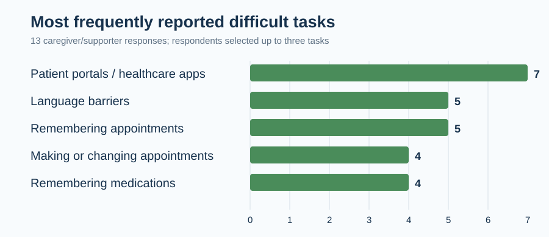
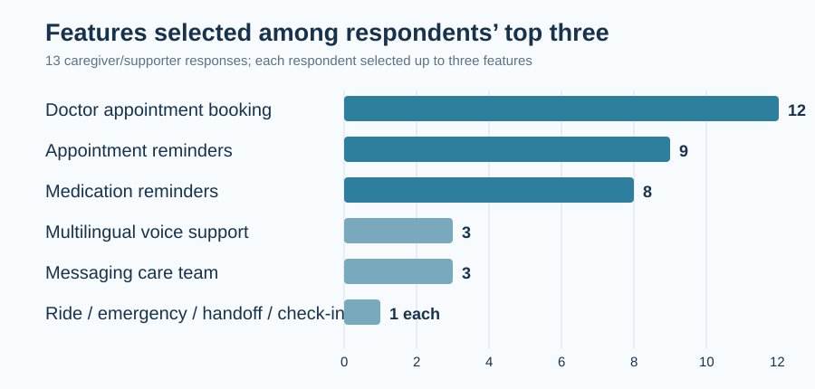

# Team 4 Project Survey Report

**Course:** CS 160 Software Engineering  
**Project:** Healthcare-first voice assistant for older adults  
**Survey period:** Week 3  
**Responses analyzed:** 13

## Team 4

| Team member | GitHub username / alias |
| --- | --- |
| Moebius Yang | |
| Zohreh Ashtarilarki | ZohrehAshtarilarki |
| Amarjargal Ayurzana | Akiko0210 |
| Kunj Shah | kunjcr2 |

---

## Executive Summary

The survey supports building a healthcare-first voice assistant that reduces the effort of managing medical appointments and medications. Doctor appointment booking was the clear highest-priority feature, followed by appointment and medication reminders. The results also show a meaningful need for multilingual interaction, explicit confirmation before consequential actions, and privacy-conscious caregiver access.

The first prototype should focus on appointment management, reminders, medication support, multilingual voice interaction, and confirmation controls. Ride booking and always-on proactive conversation should not be core Sprint 1 features because the survey support for them was limited or mixed.

> **Important limitation:** Every respondent identified as a caregiver or supporter of an adult aged 60 or older. These results describe caregiver-reported needs and preferences; they do not establish that older adults themselves hold the same views. Direct older-adult responses are needed in a later survey round.

## Survey Method

The Google Form asked respondents about barriers to healthcare tasks, preferences for voice-assistant features, trust in automated actions, language support, caregiver visibility, and proactive check-ins. Respondents could select up to three tasks they found difficult and up to three product features they would prioritize.

## Respondent Profile

| Measure                                    | Result                                            |
| ------------------------------------------ | ------------------------------------------------- |
| Total responses                            | 13                                                |
| Respondent role                            | 13 of 13 caregivers/supporters of someone age 60+ |
| Preferred languages represented            | English, Spanish, Vietnamese, Mandarin/Cantonese  |
| Non-English preferred-language respondents | 6 of 13                                           |

Because the sample was collected through the course survey exchange, it is a small convenience sample. Results are appropriate for feature prioritization in this course project, but not for generalizing to all older adults or caregivers.

## Findings

### 1. Healthcare scheduling is a real source of friction

Seven of 13 respondents reported that the older adult had delayed or avoided making a medical appointment at least once because the process was difficult, confusing, or frustrating. Three respondents were unsure, meaning only three gave a clear "No."

Using patient portals or healthcare apps was the most frequently selected difficult task (7 of 13). Language barriers and remembering appointments were each selected by 5 respondents. Making or changing appointments and remembering medications were each selected by 4 respondents.

### 2. Appointment management should be the central product capability

Doctor appointment booking was selected by 12 of 13 respondents as one of their three priorities. Appointment reminders were selected by 9 respondents, and medication reminders by 8. This establishes a clear healthcare-management focus rather than a general-purpose assistant focus.

### 3. Language support is a core accessibility requirement

Respondents named English, Spanish, Vietnamese, and Mandarin/Cantonese as preferred languages. The importance of speaking and understanding the user’s preferred language averaged **4.4 out of 5**. Ten respondents said they would be more likely to use the product if it could communicate entirely in their preferred language; the other three selected "Maybe."

Among the six respondents who identified a non-English preferred language, five rated multilingual voice support as "Extremely useful." The prototype should therefore support multilingual interaction as an accessibility feature, not as an optional enhancement.

### 4. Trust requires explicit confirmation and a recovery path

For actions involving money, 10 of 13 respondents would allow the action only if they approved every transaction. Two would allow only small amounts, and one would not allow it. Trust in appointment automation was positive but conditional: 3 respondents said "Yes" and 5 said "Probably," while 4 were unsure and 1 said "Probably not."

The assistant must read back the doctor, date, time, location, and any cost before acting. It must wait for explicit approval and provide a clear way to undo or seek human help when it cannot understand the user.

### 5. Proactive check-ins and caregiver access need user control

Proactive check-ins were mixed: 7 respondents said that usefulness depended on frequency, while several described them as unwanted or annoying. Check-ins should be off by default or configured during setup, with an easy voice command to pause them.

Respondents commonly approved sharing upcoming appointments and medication status with a trusted caregiver, but conversation transcripts were selected by only one respondent. Several respondents explicitly selected that the user should choose exactly what is shared. Caregiver access should show only consented, task-level status and never expose conversation transcripts.

## Recommended Feature Scope

The project began with 15 candidate features. Based on the survey, the following eight form the recommended scope for the prototype and near-term backlog.

| Priority | Feature                                | Survey rationale                                                                                   |
| -------- | -------------------------------------- | -------------------------------------------------------------------------------------------------- |
| 1        | Voice conversation engine              | The interaction model that makes the rest accessible without typing or complex navigation.         |
| 2        | Confirm-and-undo controls              | Required for trust before bookings, messages, or money-related actions.                            |
| 3        | Doctor appointment booking             | Selected by 12 of 13 respondents; the strongest feature signal.                                    |
| 4        | Appointment lookup and reminders       | Appointment reminders were selected by 9 of 13 respondents.                                        |
| 5        | Medication reminders and adherence     | Medication reminders were selected by 8 of 13 respondents.                                         |
| 6        | Multilingual voice support             | Strong accessibility need, especially among non-English preferred-language respondents.            |
| 7        | Message the care team / human fallback | Supports a common healthcare task and provides a safe alternative when automation fails.           |
| 8        | Consent-based caregiver companion view | Useful for appointments and medication status, but must exclude transcripts and honor user choice. |

### Deprioritized for the first prototype

- **Ride booking:** Only 1 respondent selected it among their top three priorities; ratings were inconsistent.
- **Always-on proactive check-ins:** Feedback was mixed and frequency-sensitive. Keep this as a configurable future feature.
- **Travel booking and open-ended games:** Neither addresses the strongest reported healthcare friction in this survey.
- **Fall detection:** A respondent suggested it, but it requires external hardware and validation beyond the current project scope.

## Requirements Informed by the Survey

1. The system shall present appointment options in plain spoken language and read back the selected doctor, date, time, and location before booking.
2. The system shall require explicit user confirmation before a booking, cancellation, message, or payment-related action is executed.
3. The system shall support appointment and medication reminders at user-configurable times.
4. The system shall support the user’s preferred language and provide a human or trusted-caregiver fallback after repeated speech-recognition failures.
5. The system shall let the user choose which appointment, medication, and emergency-status information a caregiver may view.
6. The caregiver view shall not expose conversation transcripts.
7. The system shall allow the user to configure, pause, or disable proactive check-ins.

## Conclusion

The responses support a focused product: a trustworthy, multilingual voice assistant for healthcare management. Appointment booking, reminders, medication support, and confirmation safeguards should drive the first prototype. The product should help caregivers support an older adult without becoming a surveillance tool. A follow-up round should recruit older adults directly so the team can compare their needs and privacy preferences with the caregiver perspective represented here.

## Source Materials

- [Survey assignment and reporting requirements](<../Sprint-(-1)/TODO.md>)
- [Project idea and candidate feature list](<../Sprint-(-1)/IDEA.md>)
- [Survey findings summary](<../Sprint-(-1)/FEATURES_RAW.md>)
- `CS 160 - Team 4 Project Survey Responses.xlsx` in `Sprint-(-1)`
- Use of LLM for factoring out mess from the draft
