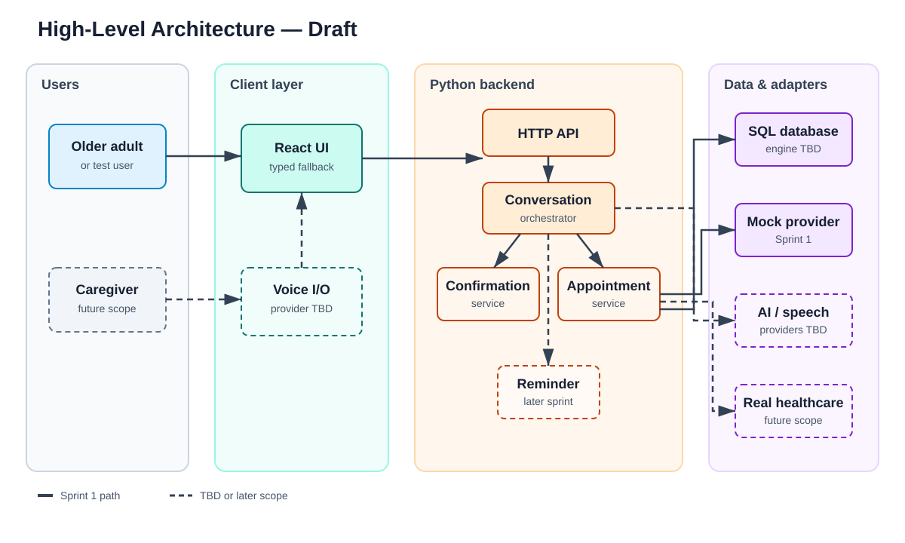
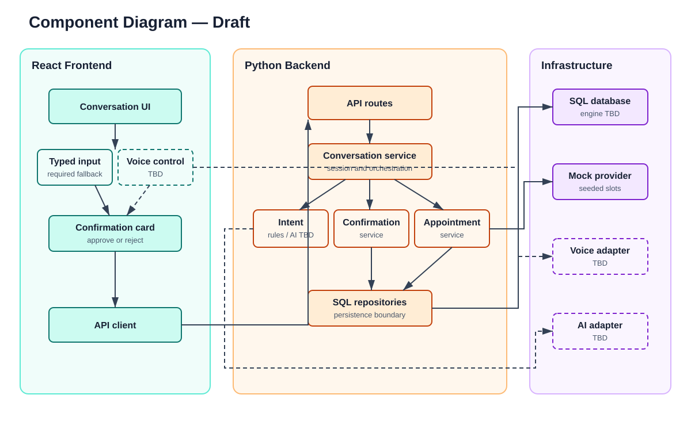
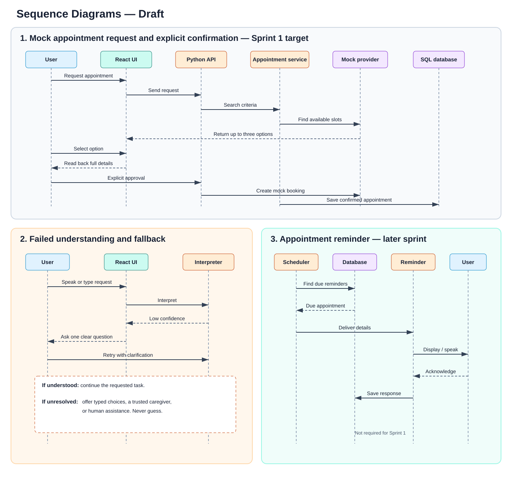
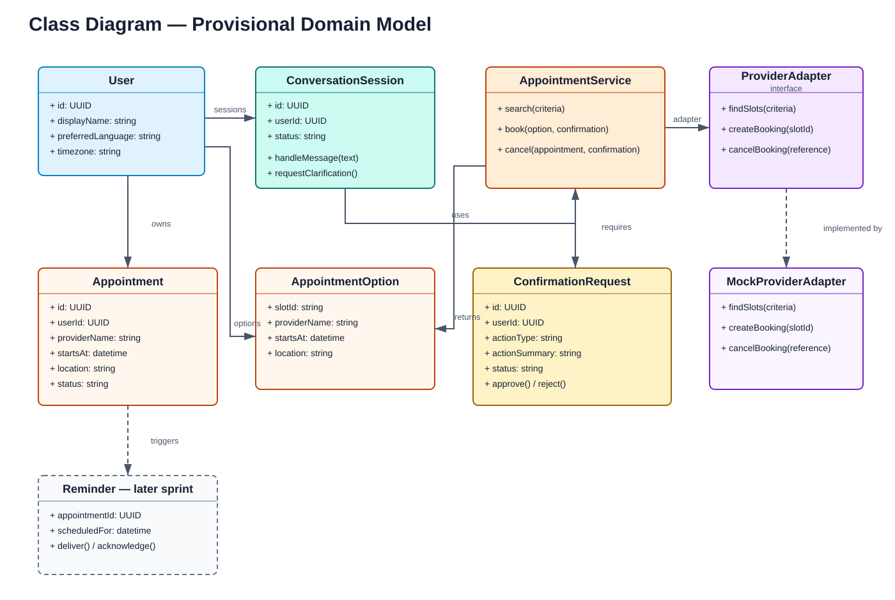

# Draft System Design

> **Draft:** The team has selected React, Python, and SQL at a high level. Frameworks, providers, database engines, and integrations remain undecided. The diagrams below are static SVG images so they display consistently in VS Code and GitHub.

## High-Level Architecture

The React client communicates with a Python HTTP API. The backend separates conversation handling, explicit confirmation, appointment logic, and persistence. Voice, AI, and real healthcare systems sit behind replaceable adapters. Sprint 1 uses typed input and a mock healthcare provider so undecided vendors do not block development.

## Component Diagram

### Sprint 1 technology position

| Area | Current decision | Sprint 1 approach |
| --- | --- | --- |
| Frontend | React | Create a minimal conversation and confirmation interface. |
| Backend | Python; framework TBD | Create a small HTTP API and keep domain logic separate from routes. |
| Database | SQL; engine TBD | Agree on the schema before selecting a local development engine. |
| Voice | TBD | Research options; typed input remains the required fallback. |
| AI | TBD | Start with deterministic mock/rule behavior so integration is not blocked. |
| Healthcare integration | Not available | Use a mock provider adapter with seeded appointment slots. |
| Authentication | TBD | Keep demonstration data local and do not store real health information. |

### Architectural principles

1. Require explicit confirmation before a booking, cancellation, message, or payment-related action.
2. Keep voice and AI providers behind adapters so they can be changed later.
3. Keep the core flow usable through typed input while voice is undecided.
4. Use mock data only; do not collect or store real protected health information.
5. Separate frontend, API, domain services, persistence, and external adapters.

## Sequence Diagrams

The first sequence—the mocked appointment request and confirmation flow—is the proposed Sprint 1 implementation target. Failed-understanding fallback and appointment reminders establish expected behavior for later development.

## Class Diagram

The first vertical slice requires `ConversationSession`, `AppointmentOption`, `ConfirmationRequest`, `Appointment`, `AppointmentService`, and `MockProviderAdapter`. `Reminder` is included to show the expected next-sprint relationship but is not required for Sprint 1.

## Open Design Decisions

- Python web framework
- SQL database engine and data-access library
- Voice recognition and text-to-speech provider
- AI model/provider and whether AI is necessary for the first vertical slice
- Authentication approach
- Hosting and deployment platform

