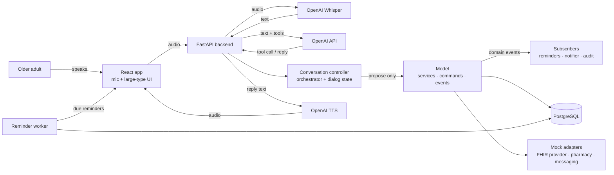
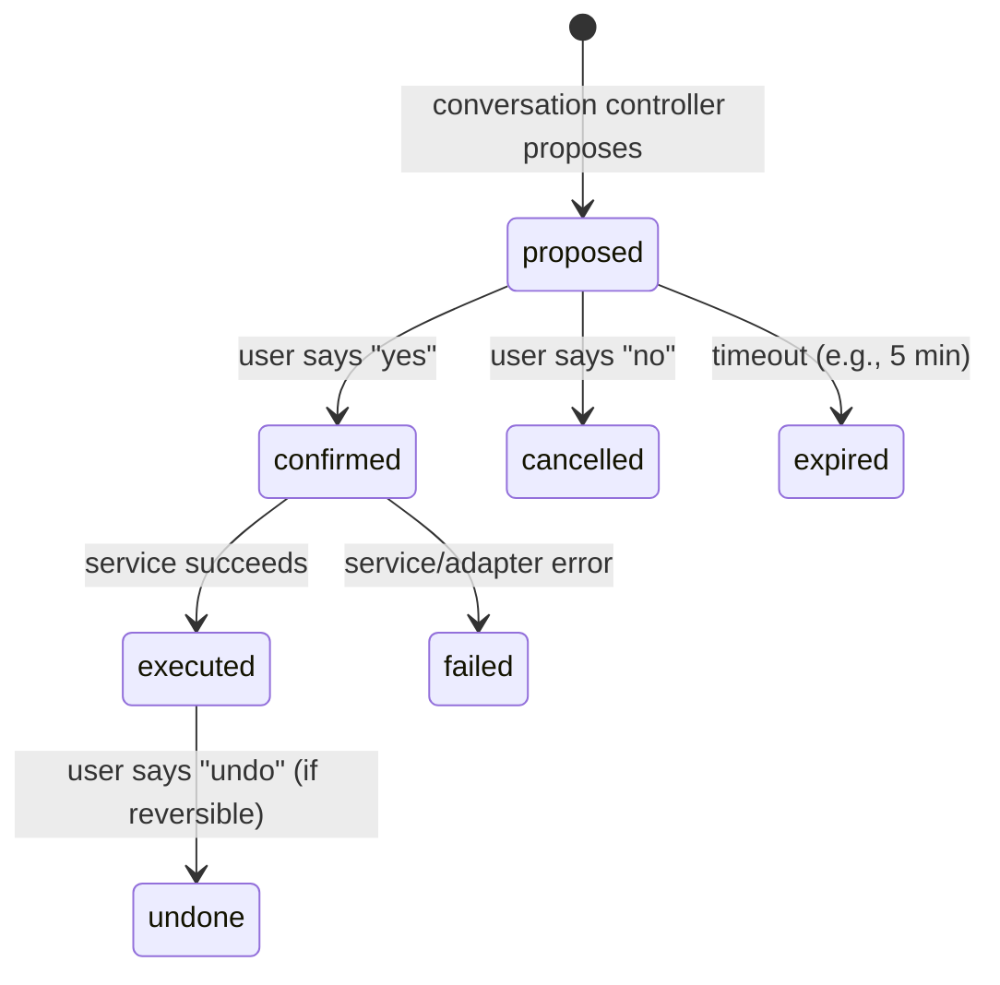

# plan.md — Voice Assistant for Older Adults (CS 160, Team 4)

> **Purpose:** the team's working project plan. Keep it in the GitHub repository and update it when scope, architecture, priorities, sprint plans, or major technical decisions change.
> Course: CS 160 Software Engineering, Section 05 · Fall 2026 · San José State University · Instructor: Dominic Abucejo
> Team 4: Moebius Yang (frontend) · Zohreh Ashtarilarki (backend) · Amarjargal Ayurzana (backend) · Kunj Shah (AI/voice)
> Repository: https://github.com/kunjcr2/CS160_Project · Code currently lives in `Dev/Backend` and `Dev/Frontend`

**This document describes the current plan. The Product Backlog and Sprint Log (shared Google Sheet) contain detailed work status and assignments.**

### How to use this file
Review it at the start of each sprint, before architecture changes, when choosing libraries or external services, when requirements change, when the team disagrees about intended architecture or scope, and before final submission. When something changes, update the relevant section and the Decision Log (§23). Don't create a conflicting second plan elsewhere.

---

## Contents
1. What we are building and why
2. Scope
3. Tech stack and technical decisions
4. Architecture
5. Cross-cutting requirements: authentication, authorization, confirmation
6. Supporting functionality
7. Error and fallback strategy
8. Feature-by-feature design and acceptance criteria
9. Data model
10. API design
11. Code structure (backend and frontend)
12. Testing strategy
13. Accessibility guidelines
14. Security and privacy guidelines
15. Non-functional targets
16. Development strategy and sprint process
17. Roadmap
18. Current state and immediate actions
19. Git and GitHub workflow
20. Definition of Done
21. Project risks
22. Open technical decisions
23. Decision log
24. Documentation and repository layout
25. Team working rules
26. Before implementation begins: checklist
27. Project success criteria

---

## 1. What we are building and why

### Project goal
Build a prototype voice-based healthcare assistant that helps older adults complete common healthcare tasks with less dependence on complicated apps and patient portals. The system makes important tasks easier through conversation while keeping important actions safe through **confirmation, clear error handling, and fallback options**.

**Sprint 1 was planning and specification only.** Feature implementation begins in Sprint 2.

### The problem
Healthcare and everyday services have moved into patient portals and apps that assume the user can log in, read small text, navigate menus, and type quickly. Many older adults can't. Their options become: wait on hold, ask a family member, or give up. Giving up is common and costly: delayed appointments, missed medications, and a growing sense of dependence.

### The product
A **voice-first assistant** that lets an older adult handle healthcare logistics **by talking**. They say what they need ("I need to see Dr. Chen next week"). The assistant works out the details, reads the action back in plain language, waits for a "yes," and only then does it.

The product principle behind every design decision:
**The user never has to navigate. They only have to talk and confirm.**

### Target users
**Primary users:** older adults who may have difficulty with healthcare apps, typing, remembering appointments or medications, communicating in English, or using voice systems that repeatedly fail to understand them.

**Secondary users:** caregivers or family members who help older adults manage healthcare tasks.

### Personas
| Persona | Role | What they need |
|---|---|---|
| **Margaret, 78** | Primary user. Arthritis, reading glasses, can't get into her patient portal. | Book and change appointments, remember meds, without a password. |
| **David, 71** | Primary user. More tech-comfortable, early hearing loss, lonely. | Simple, reliable interaction; patience with misheard words. |
| **Priya, 44** | Caregiver (David's daughter) and likely the person who sets it up. | Reassurance without surveillance. Setup that doesn't require her dad. |

### What the survey told us (13 respondents)
- Appointment booking dominates (12/13 put it in their top 3). Reminders come next.
- 7/13 said the older adult had delayed or avoided care because scheduling was too hard.
- 10/13 would allow money-related actions **only if they approve every one**. Confirmation is a trust requirement, not a nice-to-have.
- Caregivers want limited sharing (appointments, medication status), **not** conversation transcripts.
- **Limitation:** all 13 respondents were caregivers, not older adults. Treat every decision as a hypothesis until tested with real older users.

---

## 2. Scope

### The 7 core features
| ID | Feature | Priority | Points | Survey (avg / very-useful / top 3) |
|---|---|---|---|---|
| PB-01 | Doctor appointment booking | High | 8 | 3.54 · 10/13 · 12/13 |
| PB-02 | Appointment reminders | High | 5 | 3.54 · 8/13 · 9/13 |
| PB-03 | Medication reminders | High | 8 | 3.62 · 9/13 · 8/13 |
| PB-04 | Prescription refill assistance | Medium | 8 | 3.46 · 8/13 · 0/13 |
| PB-05 | Multilingual voice support | **Stretch** (deferred, §6.8) | 13 | 3.38 · 6/13 · 3/13 |
| PB-06 | Human assistance / live-agent handoff | Medium | 8 | 3.38 · 7/13 · 1/13 |
| PB-07 | Messaging a doctor / care team | Medium | 8 | 3.23 · 5/13 · 3/13 |

The seven core features stay fixed unless the team formally changes scope (§25).

**PB-05 is a stretch goal.** We build English-only first and add other languages only if time allows after the other six features work. The system is designed so it can be added later without redesign (§6.8). See the Decision Log (§23).

### Supporting system requirements (not additional core features)
Every feature depends on these:
1. **Conversational interface.** Users interact naturally by voice. Text input and transcripts are used during early development before the full voice flow is connected, and remain available as a fallback.
2. **Authentication**: who is this? (§5.1)
3. **Authorization**: what are they allowed to see and do? (§5.2)
4. **Confirmation before important actions**: nothing that changes the outside world (booking, sending a care-team message, submitting a refill) happens without an explicit "yes." (§5.3)
5. **Error handling and fallback**: explain the problem, ask a simpler question or retry, offer another path, and offer human help when automation can't continue. (§7)
6. **Mock healthcare services**: mock provider, pharmacy, appointment, and care-team services and data instead of real hospital integrations. (§6.2)

In the team spreadsheet (Product Backlog tab), the supporting work planned for Sprint 2 is tracked as **SR-01 to SR-08**:

| ID | Supporting work | Plan reference |
|---|---|---|
| SR-01 | FastAPI backend with MVC structure | §4, §11 |
| SR-02 | PostgreSQL + Alembic migrations | §9, §19 |
| SR-03 | Authentication (users, sessions, login, pairing codes) | §5.1 |
| SR-04 | Authorization and consent | §5.2 |
| SR-05 | Confirmation pipeline (pending actions, confirm endpoint) | §4, §5.3 |
| SR-06 | Mock healthcare provider + demo data | §6.2, §6.12 |
| SR-07 | Reminder worker + notifications | §6.3, §6.4 |
| SR-08 | Conversation controller + AI tool calling | §4, §6.6 |

More SR items are added as later sprints are planned (for example, the voice pipeline and the emergency guardrail in Sprint 3).

### Out of scope (say this explicitly in reports)
- Real integrations with Epic/Cerner (FHIR), pharmacies, rideshare, airlines, or payments. These need health-system partnerships, security reviews, and contracts. **We use mock adapters shaped like the real APIs.**
- Medical advice, diagnosis, or clinical emergency detection beyond a basic "call 911" safety guardrail.
- Fall detection or any hardware.
- HIPAA certification or clinical validation. We design *toward* HIPAA-aligned handling, but we don't claim compliance.
- Transportation and travel booking were in the original idea but are **not** among the 7. Ride booking scored weakest in the survey.
- A full caregiver dashboard. We design the data model so it can be added later (§5.2).

---

## 3. Tech stack and technical decisions

| Layer | Technology | Purpose / notes |
|---|---|---|
| Frontend | React (Vite) | Web UI, conversation interface, large-type display, mic and audio playback, accessible controls. Owned by Moebius. |
| Backend | **Python + FastAPI** | Controllers, validation, business logic, AI integration and coordination. Migrated from Flask in Sprint 2 (§18). |
| Database | PostgreSQL | Users, preferences, appointments, medications, reminders, messages, statuses. Migrations from day one. |
| Speech-to-text | OpenAI Whisper (API) | Handles many languages and auto-detects language. |
| Text-to-speech | OpenAI TTS | Multilingual spoken output; adjustable speed. |
| AI | OpenAI API | Intent understanding, slot extraction, multilingual processing, natural replies via **tool / function calling**. |
| External services | Mock adapters | FHIR-shaped mock provider, mock pharmacy, mock care-team messaging. |
| Version control | Git + GitHub | Branches, commits, pull requests, collaboration (§19). |
| Documentation / tracking | Google Docs + Google Sheets | Sprint reports, product backlog, sprint backlog, assignments, hours, logs. |

### Current technical decisions
- React is the frontend.
- Python/FastAPI is the main backend.
- PostgreSQL is the database.
- **OpenAI is the AI/voice provider**: Whisper for speech-to-text, TTS for speech output, the OpenAI API for language understanding and replies.
- AI integration stays **inside the same backend application**. A separate AI server isn't required for the prototype.
- Provider-specific code stays behind interfaces in the backend's `adapters/` package (`adapters/llm`, `adapters/speech`, `adapters/healthcare`), so a provider could be swapped without touching the model or controllers.
- **The system follows MVC** (Model-View-Controller), designed using the methods and patterns in §4 and §16.
- **Docker is not currently part of the project plan.** PostgreSQL is installed locally by each developer.
- Real healthcare integrations are replaced by mock services.

### Backend libraries (chosen in Sprint 2)
Versions are pinned in `Dev/Backend/requirements.txt` (runtime) and `requirements-dev.txt` (test tools). `~=` allows bug-fix updates only, so every teammate gets the same behavior.

| Need | Library | What it does for us |
|---|---|---|
| Web framework | FastAPI ~0.142 + uvicorn | Receives requests from React, runs the matching Python function, returns the answer. Generates `/docs`. |
| ORM | SQLAlchemy 2.1 | Lets us work with tables as Python classes instead of writing SQL by hand. |
| Driver | psycopg 3 | Carries SQLAlchemy's commands to PostgreSQL. |
| Migrations | Alembic | Records every table change as a file in Git so every laptop's database matches (§19). |
| Validation / settings | Pydantic v2 + pydantic-settings | Request/response validation; loads `.env`. |
| Password hashing | argon2-cffi | Never store plain passwords. |
| Tokens | PyJWT | Short-lived access tokens. |
| HTTP client | httpx | Calls to OpenAI and mock services. |
| OpenAI SDK | `openai` (official Python SDK) | Whisper, TTS, chat with tools. |
| Background jobs | DB-polling worker (§6.3) | Reminders fire even when nobody is making a request. |
| Testing | pytest, pytest-asyncio, FastAPI `TestClient`, local test database `voice_assistant_test` | |
| Lint / format | ruff (config in `pyproject.toml`) | One tool for both. |

How a request flows through them: React → FastAPI → our code (rules, confirmation) → SQLAlchemy → psycopg → PostgreSQL. Alembic is not on this path; it only runs when table shapes change.

### Local development tools
Every developer installs:
- **Git** (on Windows, Git for Windows, which includes Git Bash).
- **Python 3.12 or newer.** The whole team uses the same minor version; one virtual environment per project (`.venv`).
- **PostgreSQL** (local, no Docker) with the `psql` client. The whole team uses the same major version.
- **Node.js (current LTS) + npm**, to run the frontend locally, including for backend developers testing the full flow.
- **A code editor** (VS Code with Python/Pylance/Ruff extensions, or PyCharm).
- **A modern browser** with dev tools (network, cookies, SSE), plus Lighthouse or axe DevTools for accessibility.

Optional: a database GUI (**DBeaver Community** recommended; pgAdmin or DataGrip also fine), an API client (Bruno, Postman, HTTPie), and ffmpeg for whoever works on voice. Use a database GUI to *look* at data and run queries, never to create or change tables (§25 rule 14).

Not needed: Docker, Redis, or a message queue. An OpenAI key is not needed for most work when `FAKE_AI=true`.

> Verify current OpenAI model names (transcription, TTS, chat) in OpenAI's docs before coding. They change often. Keep model names in config, never hard-coded.

---

## 4. Architecture

### High-level block view
```text
Older Adult / Caregiver
          |
          v
     React Frontend
          |
          v
   Python / FastAPI Backend
      /        |         \
     /         |          \
    v          v           v
PostgreSQL   OpenAI       Mock Healthcare /
Database     (Whisper,    Provider Services
             TTS, API)
```

### Detailed flow


### MVC architecture

The system uses **Model-View-Controller**. *Head First Design Patterns* (Freeman & Robson, 2020, ch. 12) describes MVC as a **compound pattern**: the model uses **Observer** to notify views of changes, the view and controller form a **Strategy** pair, and the view is a **Composite** tree of components. On the web the three parts are split between browser and server; ours is split like this:

| MVC part | Where it lives | What belongs there |
|---|---|---|
| **View** | React (`Dev/Frontend/src/views/`) + a thin server-side view (`app/views/`) | React: what the user sees and hears. Server: response schemas, all user-facing sentences (`messages.py`, English for now, §6.8), and rendering a reply as audio (TTS is presentation). |
| **Controller** | FastAPI (`app/controllers/`) | Thin route controllers, plus the **conversation controller** (orchestrator + dialog state). Controllers parse input, identify the caller, call **one** model operation, and choose a view. No business rules. |
| **Model** | `app/model/` + PostgreSQL | The whole domain, not just tables: entities, services, **commands** (pending actions), domain **events**, repositories. **The only place actions execute.** |
| **Adapters** (outside the trio) | `app/adapters/` | Interfaces + implementations for external systems: healthcare provider, language model, speech. Mock/fake now, real later. |

**The conversation orchestrator is a controller, not part of the model.** In MVC the controller interprets user input and turns it into calls on the model; that is exactly what the orchestrator does with an utterance. It may only call the model's `propose_*` operations. Execution happens only through the separate actions controller (`POST /actions/{id}/confirm`). This makes the golden rule structural rather than a convention.

**Same model output, different views.** A booking result is produced once by the model. `/ai/process` renders it as JSON text; `/ai/voice` renders the same reply as audio via `views/speech.py`.

Rules:
- The frontend never connects to PostgreSQL and never holds the OpenAI API key. React talks only to FastAPI.
- Controllers talk to the model only through services (the model's facade; Principle of Least Knowledge). Controllers never use repositories or adapters directly.
- Only `adapters/llm` and `adapters/speech` talk to OpenAI.

**Golden rule: the AI never executes anything.** It can only *propose*. The model validates every proposal against the database and the user's permissions, then waits for confirmation (§5.3).

### Design patterns used (and why)

From *Head First Design Patterns*. Use a pattern only where it solves a stated requirement; each row names that requirement.

| Pattern | Where | Requirement it solves |
|---|---|---|
| **Command** | Each pending action is a Command class: `BookAppointment`, `CancelAppointment`, `RescheduleAppointment`, `RequestRefill`, `SendCareMessage`, `RequestHumanHelp` (`model/commands/`) | Confirmation (§5.3), idempotency, undo, audit log. `pending_actions` is a persisted command queue. |
| **Template Method** | `ActionService.confirm()` runs fixed steps: ownership → expiry → revalidate → execute → record → publish event | No feature can skip or reorder confirmation steps. |
| **Observer** | The model publishes domain events (`AppointmentBooked`, `AppointmentCancelled`, `ReminderDue`, `RefillStatusChanged`, `ActionExecuted`); subscribers in `model/subscribers/` react. SSE is the web form of "model notifies view." | Reminders follow bookings without PB-01 knowing about PB-02; notifications to the view; audit logging. |
| **State** | Conversation state: `Idle`, `CollectingDetails`, `AwaitingConfirmation`, `Handoff` (`controllers/conversation/states.py`) | "Yes" means confirm only while awaiting confirmation (§6.6). |
| **Strategy + Factory** | `HealthcareProvider`, `LanguageModel`, `SpeechToText`, `TextToSpeech` interfaces; `main.py` picks implementations from config | `FAKE_AI` mode, mock services, swappable provider. |
| **Adapter** | A future FHIR provider adapts FHIR resources to our domain objects | Real integrations later without touching services. |
| **Decorator** | Retry, timeout, rate-limit, and logging wrappers around AI and provider clients (`adapters/resilience.py`) | §6.10 reliability without cluttering clients. |
| **Strategy (client)** | `useVoiceInput` and `useTextInput` share one interface in React | Text fallback when voice fails (§7). |
| **Composite** | React component tree | Large-type, accessible screens built from small reusable parts. |

**Command sketch** (the core of the backend):
```python
class ActionCommand(ABC):
    reversible: bool = False                 # explicit capability (LSP: callers check it)

    @abstractmethod
    def summary(self, lang: str) -> str: ...            # what gets read back
    @abstractmethod
    def revalidate(self, uow) -> None: ...              # e.g. slot still free?
    @abstractmethod
    def execute(self, uow) -> dict: ...
    def undo(self, uow, result: dict) -> None:          # only called if reversible
        raise ActionNotReversible

class ActionService:                                    # the Invoker
    def confirm(self, action_id, user):
        row = self.repo.lock_owned(action_id, user.id)  # 404 if not theirs
        if row.status != "proposed" or row.is_expired():
            return row.result                           # idempotent
        cmd = command_registry.build(row.action_type, row.payload)
        cmd.revalidate(self.uow)
        row.result, row.status = cmd.execute(self.uow), "executed"
        self.events.publish(ActionExecuted(row))
```
A new feature action means **one new Command class registered in `command_registry`**. If adding a feature requires editing `ActionService` or the orchestrator's core loop, the design is leaking; refactor first (Open-Closed Principle).

**Deliberately not patterns:**
- The pending-action lifecycle (§5.3) is an **allowed-transitions table** enforced inside `ActionService`, not State-pattern classes. Behavior doesn't vary per state there; it does in the conversation, which is why State is used there.
- `SendCareMessage` is not reversible. It sets `reversible = False` rather than overriding `undo()` to fail unexpectedly (Liskov Substitution Principle).

---

## 5. Cross-cutting requirements

### 5.1 Authentication

Older adults struggle with passwords. Margaret's portal lockout is literally in our persona. So the design separates **setup** (done by a caregiver) from **daily use** (no password typing).

| Who | How they sign in |
|---|---|
| Caregiver / account owner | Email + password, hashed with argon2. Creates the older adult's profile. |
| Older adult | **Device pairing**: the caregiver generates a one-time pairing code; the older adult's device redeems it once and receives a long-lived **refresh token**. After that the device stays signed in. |
| Admin / support agent | Email + password, seeded. Used for the handoff feature. |

Token design:
- **Access token**: JWT, ~15 minutes, contains `sub` (user id) and `role`.
- **Refresh token**: random opaque string, stored **hashed** in `sessions` table, sent as an `HttpOnly`, `Secure`, `SameSite` cookie. Revocable (lost device, caregiver revokes).
- Logout = revoke the session row.

This satisfies NFR-8 from the idea doc: setup can be done by a remote caregiver without the older adult's participation.

### 5.2 Authorization

Roles: `older_adult`, `caregiver`, `support_agent`, `admin`.

Rules:
- An older adult can access **only their own** data.
- A caregiver can access an older adult's data **only through a consent grant**, and **only the scopes granted** (e.g., `appointments:read`, `medications:read`). Survey respondents wanted "the user chooses exactly what is shared."
- **Conversation transcripts are never a grantable scope.**
- A support agent can see only handoff tickets assigned to them, plus the minimum context attached to the ticket.

Implementation:
- A FastAPI dependency `get_current_user()` decodes the token.
- A second dependency `require_access(owner_id, scope)` checks ownership or a valid consent grant.
- **Every query that returns user data filters by owner.** Never fetch by id alone (`GET /appointments/42` must check that appointment 42 belongs to the caller). Missing this check is the most common real-world API vulnerability (IDOR).
- Write tests that try to read another user's data and expect `404` (preferred over `403`, so we don't leak existence).

### 5.3 Confirmation before action (the most important backend design)

Every action that changes the outside world goes through a **pending action**:



How it works:
1. The user says, "Book me with Dr. Chen Tuesday morning."
2. The conversation controller asks the LLM (via `adapters/llm`), which returns a tool call like `propose_booking(slot_id=...)`.
3. The model **builds a `BookAppointment` command and validates it** (the slot exists, it's free, the user owns this request) and creates a `pending_actions` row with a plain-language summary:
   *"Dr. Chen, cardiology, Tuesday October 13th at 10:30 in the morning, at the Valley Medical building. Should I book it?"*
4. The summary is spoken via TTS **and** shown in large type.
5. Only `POST /actions/{id}/confirm`, made by the **same user** before expiry, executes it.
6. The result is spoken back: *"Done. You're booked."* Or on failure: *"I couldn't book that. You can call the office at …"*

Rules:
- Confirmation needs a **clear yes**. "Maybe," "I guess," or silence is not a yes. Ask again.
- The confirm endpoint is **idempotent**. A double-tap or retry must not book twice (store an idempotency key; the state check `proposed → confirmed` happens in one transaction).
- One pending action per user at a time keeps the conversation simple.
- Applies to: booking, cancelling, rescheduling, refill requests, sending messages, and handoff requests. Reading data (e.g., "What do I have this week?") does **not** need confirmation.
- **Never report success unless the change was actually saved** (§7).
- Log every transition in `audit_log` (an `audit` event subscriber, §4).
- Each `action_type` maps to one Command class (§4); `payload` holds its arguments so the command can be rebuilt at confirm time.

---

## 6. Supporting functionality

These aren't in the feature list, but the 7 features won't work without them.

### 6.1 User profile and onboarding
- Name, preferred name ("call me Maggie"), **preferred language**, **time zone**, speech speed, volume preference.
- Emergency contact and care team contacts (doctors, pharmacy of record).
- The caregiver fills this in during setup.

### 6.2 Mock provider service (FHIR-shaped)
Shape the mock data after real FHIR resources so the engineering is credible:
`Practitioner`, `Slot`, `Appointment`, `MedicationRequest`, `Communication`.
- Add realistic **latency** and **random failures** (configurable). Our error paths need something to test against.
- Put it behind an interface (`HealthcareProvider`) in `app/adapters/healthcare/`, with `MockHealthcareProvider` as the only implementation for now.

### 6.3 Scheduler / background worker (needed by PB-02 and PB-03)
Reminders must fire even when nobody is making a request. Recommended simple, robust design:
- Reminder tables with `due_at`, `status`, `payload`.
- A worker loop every ~30 seconds runs:
  `SELECT … WHERE due_at <= now() AND status = 'scheduled' FOR UPDATE SKIP LOCKED`
  which safely claims due rows even if two workers run.
- It marks them `sent` and pushes them to the user (§6.4).
- Handles **missed** doses: if no "taken" confirmation within N minutes, re-prompt once, then record `missed` (FR-8.3).
- Status values (one set per table, enforced by CHECK constraints, §9):
  - `appointment_reminders`: `scheduled → sent → acknowledged`, or `cancelled` / `failed`.
  - `medication_reminders`: `scheduled → sent → taken | missed`, or `cancelled` / `failed`.
- `due_at` is stored in UTC but **computed from the user's local time zone** with `zoneinfo` ("day before", "morning of"). Never subtract 24 hours from a UTC time; that breaks across daylight-saving changes.

### 6.4 Notification delivery to the user
A web app can't speak if it's closed. Decide early:
- **Minimum:** the React app, while open, polls `GET /notifications` or holds a **Server-Sent Events** stream; due reminders are spoken via TTS.
- **Better:** browser Web Push so reminders arrive when the tab is in the background.
- Be honest in reports: for the demo, the device is assumed to be on with the app open (like a kitchen tablet).

### 6.5 Time zones and recurring schedules
- Store all timestamps in **UTC** (`timestamptz`). Convert to the user's zone only for display and speech.
- Medication schedules are "8:00 AM and 8:00 PM *local time*." Store the time-of-day plus the user's time zone, and generate concrete dose events (e.g., daily for the next 7 days). Daylight saving time will break naive approaches.

### 6.6 Conversation state
- Dialog states (State pattern, §4): `Idle` → `CollectingDetails` (asking for the one missing piece) → `AwaitingConfirmation` (a pending action exists; "yes"/"no" map to confirm/cancel) → back to `Idle`. Any state can move to `Handoff` (§7). Each state decides how to interpret the next utterance.
- A `conversations` table and short-lived message history so the LLM has context ("no, the *other* Tuesday").
- Context window limits: send only the last few turns plus a structured summary of the pending action.
- **Data minimization:** delete raw audio right after transcription; keep transcripts only as long as needed (NFR-6).

### 6.7 Safety guardrails
- No medical, legal, or financial advice; redirect to a professional (FR-13.3).
- If a message to the care team contains emergency language ("chest pain," "can't breathe"), **don't send it as a message**. Tell the user to call 911 (FR-6.3). Start with a keyword list plus an LLM check, and document the limits.

### 6.8 Multilingual support: deferred now, designed to grow later (PB-05)

**Decision (Sprint 2):** multilingual voice support is a **stretch goal**. We build and demo everything in English first, and add other languages only if time allows after the other six features work. Reasons: PB-05 is the largest item (13 points), it touches every feature, and it ranked lowest for top-3 importance in the survey (3/13).

**What "deferred" means.** We skip the work: no translations, no Spanish templates, no translated date formats, no language switching. We do **not** write code that would block adding it later.

**What is already in place:**
- `users.preferred_language` exists (default `"en"`).
- **The database stores facts, not sentences.** A reminder is saved as `kind = "day_before"` plus `due_at`, not as English text. Statuses are codes (`scheduled`, `booked`). The sentence is built only when it is sent, so the same row can later become a Spanish sentence with no database change.
- **All backend sentences live in one file**, `app/views/messages.py` (booking, reminders, confirmation, errors). There are no English sentences inside services, commands, or workers.
- Speech and the LLM are behind interfaces (`adapters/speech`, `adapters/llm`). Whisper already understands many languages and TTS can speak them, so adding a language there is mostly configuration.

**Habits to follow now** (cheap today, expensive to fix later):
1. **Pass the user's language through every layer**, even though only `"en"` exists. A service that produces user-facing text receives `lang` and passes it to the view.
2. **Take user-facing text only from `views/messages.py`.** Before the first feature uses messages, add one small helper, `say(key, lang, **values)`, and call it everywhere instead of formatting the constants directly. Today it ignores `lang`; later only the helper changes, not every place that uses it.
3. **Format dates and times in one function** (e.g. `format_when(dt, lang, timezone)`), never inside services. "Tuesday, October 13" vs. "martes 13 de octubre" is then a one-place change.
4. **Decide "is this a yes or a no?" in one place.** Confirmation is our golden rule (§5.3); English-only keyword checks scattered in the code would make *"sí"* never confirm anything.
5. **Write the AI instructions with a language parameter** (*"Reply in {language}"*), filled with `"en"` for now.
6. **Store codes in the database, not display text** (statuses, reminder kinds).

**How to add it later, if time allows:**
1. Choose languages. Start with Spanish (survey languages: English, Spanish, Vietnamese, Mandarin/Cantonese).
2. Split `views/messages.py` into one file per language with the same keys (`messages/en.py`, `messages/es.py`). `say()` picks the file by `lang` and falls back to English for any missing key.
3. Make `format_when()` produce localized dates (e.g. with the Babel library).
4. Pass the language to Whisper as a hint, pick a TTS voice per language, and fill the AI prompt's `{language}`.
5. Teach the yes/no decision the new language ("sí", "no").
6. Add a `language` column to `pending_actions` so the audit log shows which language a summary was read in (one Alembic migration).
7. Let users set their language in the profile; optionally switch by voice ("speak Spanish").
8. Frontend: Moebius moves on-screen labels into a translation library (React UI text is English-only today).
9. Tests: a Spanish booking end to end; a missing translation falls back to English; an unsupported language falls back to English with a clear message.

Expected size: mostly **adding** files and settings. No table redesign and no change to the MVC structure; one small migration.

**Cheaper fallback for the demo:** the conversation itself can work in Spanish (Whisper understands it and the AI is told to reply in Spanish) while backend-generated reminders and summaries stay English. This shows partial PB-05 progress for little cost.

### 6.9 Audit log
Who did what, when: logins, consent grants, every pending-action transition, caregiver access. Essential for trust, debugging, and the "undo" feature.

### 6.10 Cost, rate limits, and reliability for OpenAI
- Timeouts and retries with backoff on every OpenAI call, implemented as decorators around the adapter clients (`adapters/resilience.py`).
- Per-user rate limiting to protect the team's API budget.
- A `FAKE_AI=true` mode that returns canned responses, so tests and frontend work don't spend money or need a key.

### 6.11 Secrets and configuration
- `.env` for `DATABASE_URL`, `OPENAI_API_KEY`, `JWT_SECRET`, model names. **Never commit `.env`.** Commit `.env.example`.
- If a key is ever committed, rotate it immediately; deleting the commit isn't enough.

### 6.12 Seed / demo data
Seed Margaret's story: her cardiologist and physical therapist, four medications (two twice daily), open slots next week, a pharmacy of record, a caregiver (her son), and a support agent. The demo then has a real narrative. Use only mock/demo health information, never real patient data.

### 6.13 Observability
Health endpoint (already exists), structured logs with a request id, and **no health data or audio in logs** (log ids, not content).

---

## 7. Error and fallback strategy

General pattern when a request can't be understood or completed:
1. explain the problem clearly;
2. ask a simpler clarifying question or retry;
3. offer another path when possible (a phone number, text input);
4. offer human assistance (PB-06) when automated help can't continue.

| Situation | Response |
|---|---|
| **AI doesn't understand** | Ask **one** clear follow-up question; don't guess (FR-1.5). Allow retry. Offer another input method. After repeated failures (e.g., 3 turns), offer human assistance. Never loop "I didn't understand" endlessly. |
| **Missing information** | Ask for the one missing piece (which doctor? which day?). Present **at most three options** at a time, in natural language, not timestamps (FR-4.2). |
| **OpenAI API fails or times out** | Return a friendly spoken/visible error; retry with backoff; never lose confirmed application data; fall back to text input if voice is failing. |
| **Database fails** | Don't report an action as successful if it wasn't saved. Return a clear error. Log useful debugging info without sensitive data. |
| **Mock provider fails** | Explain that the action couldn't be completed. Don't create a false confirmation. Allow retry or fallback (call the office). |
| **Slot taken between proposal and confirm** | Re-check inside the confirm transaction; offer the next available options. |

---

## 8. Feature-by-feature design and acceptance criteria

### PB-01 Doctor appointment booking
**Flow:**
```text
User: "I need a doctor appointment next Tuesday."
  → React (voice) → FastAPI
  → conversation controller → Whisper (transcript) → OpenAI API (tool call: search slots, date = next Tuesday)
  → appointment service (model) → mock provider → up to 3 available options
  → spoken + shown to user → user picks one
  → pending action created → confirmation read back → user says "yes"
  → POST /actions/{id}/confirm → mock provider books → saved in PostgreSQL
  → spoken confirmation: date, time, provider, location
```
Also: list upcoming, cancel, reschedule (each needs confirmation).
**Edge cases:** slot taken before confirmation, no availability (offer next week or the office phone number), ambiguous doctor name.
**Acceptance criteria:**
- user can request an appointment by voice or text;
- system presents mock available slots (max three at a time);
- user selects a slot; system asks for confirmation;
- confirmed appointment is saved; user receives confirmation;
- cannot book without confirmation; cannot double-book; cannot see others' appointments.

### PB-02 Appointment reminders
- A `reminder_scheduler` subscriber listens for `AppointmentBooked` and creates reminder rows (default: day before, morning of, 1 hour before; user-configurable).
- It listens for `AppointmentCancelled` / `AppointmentRescheduled` and cancels or moves the rows. The appointment service never calls reminder code directly (Observer, §4).

**Acceptance criteria:**
- a saved appointment can have a reminder; timing can be configured;
- reminder references the correct appointment;
- reminders fire at the right **local** time; cancelled appointments produce no reminders.

### PB-03 Medication reminders
- `medications` + `medication_schedules` → generated dose events (medication reminders).
- At dose time: spoken reminder → user says "I took it" → `taken`. No answer → one re-prompt → `missed`.
- Optional (later): notify caregiver after N consecutive misses, **only if the user consented**, and tell the user each time a notification is sent (FR-14.4).

**Acceptance criteria:**
- reminder can be created and appears in the expected prototype flow;
- user can confirm taken/missed; status is stored;
- missed-dose logic (re-prompt once, then mark missed) works.

### PB-04 Prescription refill assistance
- "I'm almost out of my blood pressure pill" → match against the user's active prescriptions (fuzzy match; confirm which one if unclear) → pending action → submit to mock pharmacy → track status (`requested → in_progress → ready`) → spoken update.
- **Edge cases:** no refills remaining (tell them to contact the doctor; offer PB-07), unknown medication.

**Acceptance criteria:**
- user can request a refill; system identifies the medication;
- system confirms before submission;
- mock refill request is recorded; request status can be shown.

### PB-05 Multilingual voice support (stretch goal)
- **Status:** deferred. English only until the other six features work (§6.8, §23).
- **Required now:** follow the six habits in §6.8 so the feature can be added without redesign.
- If implemented: profile language drives STT hints, LLM reply language, TTS voice, and backend messages; allow switching by voice ("speak Spanish"). Follow the steps in §6.8.

**Acceptance criteria (if implemented):**
- user can set and use a supported preferred language;
- supported-language input is understood through Whisper and the OpenAI API;
- responses (including reminders and confirmations) come back in the preferred language;
- unsupported languages and failures have a fallback.

### PB-06 Human assistance / live-agent handoff
- Triggered by the user ("I want to talk to a person") or by the fallback rule (§7).
- Creates a human assistance request with a short, consented summary of what the user was trying to do (not the full transcript).
- For the prototype, the handoff is **simulated or routed to a predefined contact**, not a production call center: a seeded `support_agent` user with a minimal queue endpoint, plus the option to call the caregiver/emergency contact. **Decide the exact behavior** (§22).

**Acceptance criteria:**
- user can request help; repeated recognition failures offer human assistance;
- the prototype records or simulates the handoff;
- user receives clear confirmation of what will happen next.

### PB-07 Messaging a doctor / care team
- Dictate a non-urgent message → transcription read back and shown → pending action → send via mock messaging → store thread.
- Replies arrive (mock can auto-reply after a delay) → notification → read aloud on request.
- Emergency guardrail (§6.7) runs **before** proposing the send.

**Acceptance criteria:**
- user can dictate a message; system reads/shows it back;
- user confirms before sending; mock message is recorded/sent;
- message status can be retrieved; emergency wording triggers the 911 guidance instead of sending.

---

## 9. Data model

### Domain entities (class-diagram level)
| Entity | Key attributes |
|---|---|
| User | userId, name, preferredLanguage, contactInfo, role, timezone |
| Appointment | appointmentId, userId, providerName, dateTime, status |
| AppointmentReminder | reminderId, appointmentId, reminderTime, status |
| Medication | medicationId, userId, name, dosage, schedule |
| MedicationReminder | reminderId, medicationId, reminderTime, taken/status |
| RefillRequest | requestId, medicationId, requestDate, status |
| CareMessage | messageId, userId, recipient, content, status |
| HumanAssistanceRequest | requestId, userId, reason, status |
| PendingAction | actionId, userId, actionType, summary, status, expiresAt (persisted Command, §4) |
| Provider | providerId, name, specialty, location |
| Slot | slotId, providerId, start, end, available (from the mock provider; not stored as a table) |
| ConsentGrant | grantId, olderAdultId, caregiverId, scopes |
| Session | sessionId, userId, deviceLabel, expiresAt, revokedAt |

*Provider, Slot, ConsentGrant, and Session were found by textual analysis of the booking and setup use cases (§16).*

### Database tables (first draft)
All tables have `id` (UUID), `created_at`, `updated_at`. Timestamps are `timestamptz` in UTC.

Conventions (implemented in `app/model/entities/`):
- **Statuses are text columns with a CHECK constraint**, not PostgreSQL ENUMs, because enums are hard to change in later migrations.
- **Rules are enforced by the database where possible**, using partial unique indexes (below), so a bug in Python can't break them.
- Constraint names follow one naming convention so migrations are readable.

First tables built (Sprint 2, for PB-01 and PB-02): `providers`, `appointments`, `appointment_reminders`, `pending_actions`, plus a **placeholder** `users` that the auth owner replaces with the real one. The rest are still a draft.

| Table | Key columns | Domain entity / notes |
|---|---|---|
| `users` | email (nullable for older adults), password_hash (nullable), role, display_name, preferred_name, preferred_language, timezone, speech_rate | User |
| `sessions` | user_id, refresh_token_hash, device_label, expires_at, revoked_at | Revocable logins |
| `pairing_codes` | code_hash, older_adult_id, created_by, expires_at, used_at | One-time device setup |
| `consent_grants` | older_adult_id, caregiver_id, scopes (text[]), granted_at, revoked_at | Never includes transcripts |
| `contacts` | user_id, kind (emergency/doctor/pharmacy), name, phone | User contactInfo |
| `providers` | name, specialty, location, phone, external_ref (unique) | Mirrors FHIR `Practitioner`. Time slots are **not** stored; they come from the mock provider. |
| `appointments` | user_id, provider_id, starts_at, ends_at, location, status (`booked`/`cancelled`/`completed`), external_ref | Appointment. **No double-booking:** unique `(provider_id, starts_at) WHERE status = 'booked'`. |
| `appointment_reminders` | appointment_id, user_id, kind (`day_before`/`morning_of`/`hour_before`), due_at, status (§6.3), attempts, sent_at | AppointmentReminder. Unique `(appointment_id, kind)` prevents duplicates; index on `due_at WHERE status = 'scheduled'` for the worker. |
| `medications` | user_id, name, dosage, instructions, refills_remaining, pharmacy_contact_id | Medication |
| `medication_schedules` | medication_id, time_of_day, days_of_week | Local times |
| `medication_reminders` | schedule_id, due_at, status (§6.3), confirmed_at, attempts | MedicationReminder; polled by worker |
| `refill_requests` | user_id, medication_id, status, external_ref | RefillRequest |
| `message_threads` / `care_messages` | user_id, provider_id / thread_id, direction, body, status, sent_at, read_at | CareMessage |
| `assistance_requests` | user_id, reason, summary, status, assigned_to | HumanAssistanceRequest |
| `pending_actions` | user_id, action_type, payload (jsonb), summary_text, status, idempotency_key (unique), expires_at, result (jsonb) | §5.3. **One proposed action per user:** unique `user_id WHERE status = 'proposed'`. |
| `conversations` / `conversation_turns` | user_id, language / role, text, created_at | Short retention |
| `notifications` | user_id, kind, payload, delivered_at, acknowledged_at | |
| `audit_log` | actor_id, action, target_type, target_id, metadata (jsonb), at | Append-only |

---

## 10. API design

All under `/api/v1`. All except auth and health require a valid access token. Exact endpoints may change during implementation; FastAPI's `/docs` page is the source of truth and the contract with the frontend.

| Area | Endpoints |
|---|---|
| Health | `GET /health` |
| Auth | `POST /auth/register` (caregiver) · `POST /auth/login` · `POST /auth/refresh` · `POST /auth/logout` · `POST /auth/pairing-codes` · `POST /auth/pair` |
| Users / profile | `GET /users/me` · `PATCH /users/me` |
| Consent | `GET /consents` · `POST /consents` · `DELETE /consents/{id}` |
| AI / conversation | `POST /ai/process` (text in → reply, optional pending action) · `POST /ai/voice` (audio in → transcript, reply text, reply audio, optional pending action) · `POST /ai/tts` |
| Actions (confirmation) | `GET /actions/pending` · `POST /actions/{id}/confirm` · `POST /actions/{id}/cancel` · `POST /actions/{id}/undo` |
| Appointments | `GET /providers` · `GET /slots?provider_id&from&to` · `GET /appointments` · `GET /appointments/{id}` · *(create/cancel/reschedule via actions)* |
| Appointment reminders | `GET /appointment-reminders` · `PATCH /appointment-reminders/settings` |
| Medications | `GET /medications` · `GET /medication-reminders?date=` · `POST /medication-reminders/{id}/taken` |
| Refills | `GET /refills` · *(create via actions)* |
| Messages | `GET /messages` · `GET /messages/{threadId}` · *(send via actions)* |
| Assistance (handoff) | `POST /assistance` · `GET /assistance/queue` (agent) · `PATCH /assistance/{id}` (agent) |
| Notifications | `GET /notifications` or `GET /notifications/stream` (SSE) · `POST /notifications/{id}/ack` |

Two rules:
- **State-changing operations on the outside world are not exposed directly.** They go through `/actions` so confirmation can't be bypassed. (This replaces per-resource confirm routes like `/appointments/{id}/confirm`: one confirmation mechanism for every feature.)
- React never talks to PostgreSQL or OpenAI directly (§4).

---

## 11. Code structure

Organized by MVC (§4). This is a starting structure: add modules when implementation requires them, rather than creating empty files only to match the plan.

### Backend
```text
Dev/Backend/app/
├── main.py                  # composition root: builds app, picks implementations from config (Factory)
├── config.py                # pydantic-settings, reads .env
├── db.py                    # engine, session / unit of work
├── controllers/             # CONTROLLER: thin, no business rules
│   ├── health.py            # GET /api/health (exists)
│   ├── auth.py
│   ├── users.py
│   ├── appointments.py      # read-only: list, get, slots
│   ├── medications.py
│   ├── refills.py
│   ├── messages.py
│   ├── assistance.py
│   ├── notifications.py     # SSE stream / polling
│   ├── actions.py           # confirm / cancel / undo: the only path to execution
│   └── conversation/
│       ├── endpoints.py     # /ai/process (text), /ai/voice (audio)
│       ├── orchestrator.py  # utterance → reply | question | proposal
│       ├── states.py        # Idle, CollectingDetails, AwaitingConfirmation, Handoff
│       ├── tools.py         # tool definitions; each maps to a model propose_* call
│       └── prompts.py
├── views/                   # server-side VIEW
│   ├── schemas/             # Pydantic request/response models
│   ├── messages.py          # ALL user-facing sentences (English only for now, §6.8) (exists)
│   └── speech.py            # renders reply text as audio via TextToSpeech
├── model/                   # MODEL: the only place actions execute
│   ├── entities/            # SQLAlchemy classes with small behaviors (exists: base, user*, provider,
│   │                        #   appointment, pending_action; *placeholder)
│   ├── commands/            # base.py, registry.py, book_appointment.py, cancel_appointment.py, ...
│   ├── services/            # the model's API for controllers (facade)
│   │   ├── auth_service.py
│   │   ├── action_service.py        # confirm() template method, transitions table
│   │   ├── appointment_service.py
│   │   ├── medication_service.py
│   │   ├── refill_service.py
│   │   ├── messaging_service.py
│   │   └── assistance_service.py
│   ├── events.py            # event types + publisher (Observer)
│   ├── subscribers/         # reminder_scheduler.py, notifier.py, audit.py
│   └── repositories/
├── adapters/                # outside MVC, behind interfaces
│   ├── healthcare/          # interface.py, mock.py (later fhir.py)
│   ├── llm/                 # interface.py, openai_client.py, fake.py
│   ├── speech/              # interface.py, whisper.py, openai_tts.py, fake.py
│   └── resilience.py        # retry / timeout / rate-limit decorators
├── workers/
│   └── reminder_worker.py   # polls due reminders, publishes ReminderDue
├── alembic/                 # migrations; versions/ files are named by date (exists)
├── scripts/seed.py          # Margaret demo data (stub)
├── tests/                   # conftest.py always uses voice_assistant_test (exists)
├── alembic.ini
├── pyproject.toml           # pytest + ruff settings
├── .env.example
├── requirements.txt         # runtime libraries
├── requirements-dev.txt     # + test and lint tools
└── README.md                # setup for macOS and Windows
```

Run from `Dev/Backend`: `uvicorn app.main:app --reload --port 5000` (port 5000 so the Vite proxy works unchanged).

Dependency direction: `controllers → model/services → (commands, repositories, adapters interfaces)`. The model never imports from `controllers/` or `views/`. Adapters implement interfaces the model defines.

### Frontend
```text
Dev/Frontend/src/
├── views/                   # VIEW: pages + components (Composite)
│   ├── pages/               # ConversationScreen, SetupPages (caregiver), AgentQueue
│   └── components/          # ConfirmationCard, ReminderBanner, LargeText, HelpButton, MicButton
├── controllers/             # CONTROLLER: hooks
│   ├── useConversation.js
│   ├── usePendingAction.js
│   ├── useNotifications.js  # SSE subscription
│   ├── useVoiceInput.js     # input strategies with the same interface
│   └── useTextInput.js
├── models/                  # client MODEL
│   ├── api.js               # the only code that calls fetch
│   └── store.js             # session, pending action, notifications
├── App.jsx
└── main.jsx
```
Components never call `fetch` directly; they go through controller hooks, which use `models/api.js`. This keeps views simple enough to restyle freely for accessibility.

---

## 12. Testing strategy

### Backend: priorities where bugs would break trust
1. **Confirmation can't be bypassed.** No booking, refill, or message exists without a confirmed pending action.
2. **Idempotency.** Confirming twice books once.
3. **Authorization.** User A can't read or confirm User B's anything. Caregivers see only granted scopes and never transcripts.
4. **Reminders.** Correct local times, DST boundary, cancelled appointments don't fire, missed-dose logic.
5. **Failure paths.** Mock provider, OpenAI, or database error → user gets a plain-language failure and an alternative; no false success.
6. **Conversation controller** with `FAKE_AI=true`, so tests are deterministic and free.
7. **Every use-case path is a test scenario.** Each alternate path written for a feature (§16) becomes at least one pytest case.
8. **AI output is untrusted input.** Tests feed malformed tool calls and other users' IDs to the conversation controller and expect a safe question or refusal, never an action.

Test types: unit tests for services; API endpoint tests; validation and error-path tests; repository/database tests.
Run tests against a real local PostgreSQL test database (not SQLite); behavior differs (time zones, `jsonb`, `SKIP LOCKED`).

### Frontend
Component tests where useful, input validation, API error handling, accessibility checks.

### Integration
Test complete flows:
```text
React → FastAPI → PostgreSQL → React
React → FastAPI → OpenAI → FastAPI → React
React → FastAPI → Mock Provider → PostgreSQL → React
```

### Usability testing
When possible, test with intended users (older adults, not only caregivers) for readability, voice interaction, confirmation wording, error recovery, multilingual behavior, and human fallback.

---

## 13. Accessibility guidelines
- Readable text sizes (≥24pt equivalent on the companion screen) and strong contrast.
- Avoid unnecessary interface complexity.
- Don't require typing when voice can complete the task. Voice-only must always work.
- Simple language in every spoken and written message.
- Clear confirmation before important actions.
- Avoid endless "I didn't understand" loops (§7).
- Provide fallback and help paths.
- Keyboard accessibility where applicable; semantic HTML and accessible labels.
- Target WCAG 2.2 AA.

---

## 14. Security and privacy guidelines

This is a class prototype, not a production medical system, but basic security practices still apply.
- Never commit API keys or passwords. Use environment variables; add `.env` and similar files to `.gitignore`.
- Validate all backend input (Pydantic schemas).
- Don't expose database credentials or private API keys to React or browser code.
- Hash passwords; store refresh tokens hashed; check ownership on every query (§5).
- Store only data needed for the prototype. Use mock/demo health information, never real patient data.
- Delete raw audio after transcription; keep transcripts short-lived; never put health data or audio in logs.
- Caregivers never see conversation transcripts.
- Don't claim HIPAA compliance unless actually designed and validated for it.

---

## 15. Non-functional targets (from the idea doc)

| ID | Target |
|---|---|
| Latency | Spoken reply within ~3 s (95th percentile). STT + LLM + TTS will be tight; measure early. |
| Accuracy | Speech recognition must handle slow speech, pauses, and self-corrections. |
| Privacy | Encrypt in transit (HTTPS) and at rest; no health data in logs; caregivers never see transcripts. |
| Accessibility | Large type, WCAG 2.2 AA on the companion screen. Voice-only must always work. |
| No dark patterns | No upsells, no artificial urgency, no engagement-maximizing check-ins. |
| Setup | A remote caregiver can complete setup without the older adult. |

---

## 16. Development strategy and sprint process

### Vertical slices
Don't build all seven features at the same time. Complete one small flow end to end (frontend → backend → database/external service → frontend) before expanding.

**First slice: doctor appointment booking.** It exercises React/FastAPI communication, AI request understanding, business logic, mock provider communication, confirmation-before-action, and PostgreSQL persistence. Build it with **text input first**, then add voice.

### Design method (per feature)
Based on *Head First Object-Oriented Analysis and Design* (McLaughlin, Pollice & West, 2006). Apply to each vertical slice, starting with booking:
1. **Write the use case with its alternate paths.** Main path plus what goes wrong. For booking: the user says no; slot taken before confirmation; no availability; unclear doctor name; provider timeout; three misunderstandings in a row → handoff. Attach each §7 situation to a use-case step.
2. **Textual analysis.** Nouns in the use case → candidate classes; verbs → methods. (Booking produced Provider, Slot, PendingAction; setup produced ConsentGrant and Session, §9.)
3. **Build the riskiest, most architecturally significant parts first** (the book's "three Qs": is it essential, what does it mean, how do we do it). For us: the Command pipeline with `ActionService.confirm()`, and the conversation state machine.
4. **Define interfaces before implementations.** `HealthcareProvider`, `LanguageModel`, speech interfaces, then mock/fake versions, so backend developers can work in parallel.
5. **Turn every use-case path into a test scenario** (§12).
6. **Program defensively at the AI boundary, by contract inside.** Validate every tool call's arguments and ownership; between our own services, rely on clear contracts.
7. **Check each new feature against the design.** Is it a new Command? A new event subscriber? A new adapter method? If it needs edits to `ActionService` or the orchestrator core, refactor first. Also check: encapsulate what varies, DRY, single responsibility, Liskov substitution.

### Backlog definitions
- **Product Backlog:** the complete prioritized list of project work: planning, setup, features, testing, documentation, improvements. Update it when tasks are discovered, completed, split, reprioritized, or moved between sprints.
- **Sprint Backlog:** only the work selected for the current sprint.
- **Sprint Log:** for each task: assigned member, estimated hours, date assigned, date completed, actual hours, status, blockers/notes. **Record work the day it happens.**
- The shared Google Sheet is the **source of truth** for backlog and sprint tracking. Don't duplicate detailed tracking in this file.

### Start of each sprint
1. Review the Product Backlog.
2. Select achievable work.
3. Define the Sprint Goal.
4. Create/update the Sprint Backlog.
5. Assign tasks and estimated hours to **every** team member.

### End of each sprint
1. Record completed and incomplete work.
2. Record actual hours and blockers.
3. Update the Product Backlog.
4. Write the sprint summary/retrospective.
5. Prepare the next sprint plan.

---

## 17. Roadmap (provisional)

Based on the course's Team Project Schedule: three implementation sprints are left (Sprints 2–4), then project demos in weeks 14–17. Sprint 1 was used for planning; **implementation starts in Sprint 2, the current sprint.**

**Team goal: the application is finished by the end of week 12 (Sunday, Nov 8):** all features implemented and debugged, except PB-05 multilingual (stretch goal, §6.8). Week 13 is for demo preparation, not new work.

### Milestones
| Date | Milestone |
|---|---|
| Sun, Oct 18 (end of week 9) | **End of Sprint 2.** Foundation done; **PB-01, PB-02, PB-03** work end to end by typing in the app. |
| Sun, Nov 1 (end of week 11) | **End of Sprint 3.** **PB-04, PB-06, PB-07** work end to end; voice works for every feature. |
| Wed, Nov 4 (week 12) | **Feature freeze.** No new features after this; only fixes. |
| **Sun, Nov 8 (end of week 12)** | **Application done:** all features except PB-05 implemented, tested, and debugged. |
| Sun, Nov 15 (end of week 13) | **End of Sprint 4.** Demo ready and rehearsed. |
| Weeks 14–17 (Nov 16 – Dec 13) | Project demos. |

### Sprints
The six features in scope (all except PB-05) are split **three per sprint**. The High-priority features go first because the survey ranked them highest and they share pieces: booking creates appointments, and both reminder features use one reminder worker. Sprint 3's features are each one new Command on the pipeline Sprint 2 builds.

| Sprint | Weeks · dates | Features | Also in this sprint | Demo goal |
|---|---|---|---|---|
| Sprint 1 (done) | Weeks 6–7 · Sep 21 – Oct 4 | none | **Planning and specification:** survey analysis, 7 core features, scope, diagrams, stack selection, backlogs. | Sprint 1 report |
| **Sprint 2 (current)** | Weeks 8–9 · Oct 5 – Oct 18 | **PB-01** booking · **PB-02** appointment reminders · **PB-03** medication reminders (21 pts) | **Foundation:** FastAPI migration (done), PostgreSQL + Alembic, auth, mock provider + seed data, the Command pipeline (`ActionService.confirm()`), the reminder worker, notifications to the screen. Conversation controller with tool calling (`FAKE_AI` for tests). | Book Margaret's appointment by typing in the app, with confirmation; get an appointment reminder; take or miss a medication reminder |
| Sprint 3 | Weeks 10–11 · Oct 19 – Nov 1 | **PB-04** refills · **PB-06** human assistance · **PB-07** care-team messaging (24 pts) | **Voice for every feature** (Whisper → AI → TTS); emergency guardrail; cancel and reschedule for booking | Every feature works by voice, end to end |
| Sprint 4 | Week 12 · Nov 2 – Nov 8 | none new | **Finish and debug.** Until Wed, Nov 4: close any gaps. Then: full test pass, bug fixing, edge cases (§7), the trust-critical tests in §12 (confirmation, authorization, double-confirm, time zones). | **Application done** |
| | Week 13 · Nov 9 – Nov 15 | none new | **Demo preparation:** demo script and seed data, usability test with at least one older adult, small fixes from it, rehearsal. Stretch goals if everything is done. | Demo rehearsed |
| Demos | Weeks 14–17 · Nov 16 – Dec 13 | none new | Project demos. Bug fixes only. | Final demo |

### Owners
Sprint 2 owners match the **Sprint 2 Backlog** tab in the team spreadsheet (S2-01 to S2-17). Sprint 3 owners are suggestions until Sprint 3 planning.

| Person | Sprint 2 | Sprint 3 |
|---|---|---|
| Zohreh (backend) | FastAPI migration and database setup; auth + users (first, everyone needs it); authorization and consent; mock provider + seed data; **PB-03** medication tables and schedules, plugged into the reminder worker | **PB-07** messaging (a Command) + emergency guardrail |
| Amarjargal (backend) | Command pipeline + confirm endpoint; **PB-01** booking; **PB-02** appointment reminders, including the shared reminder worker | **PB-04** refills (a Command); **PB-06** human assistance backend; cancel and reschedule (booking owner) |
| Kunj (AI/voice) | Conversation controller + tool calling for PB-01–03; Whisper and TTS working on their own | Voice pipeline for every feature; tools for PB-04, PB-06, PB-07; guardrail AI check |
| Moebius (frontend) | Conversation screen, confirmation card, reminder banner with taken/missed buttons | Microphone and audio playback, help button, support-agent queue, message and refill status screens |

### What this depends on
- **Sprint 2 is the heavier sprint**, because it carries the foundation as well as three features. The foundation pieces (auth, the Command pipeline, the reminder worker) must be done early in Sprint 2, since all three of its features depend on them. Zohreh starts with auth, and Amarjargal with the Command pipeline, in the first days.
- **Zohreh's PB-03 needs Amarjargal's reminder worker.** Build the medication tables and schedules first, then plug them into the worker once it exists.
- Sprint 3's features are lighter because each one reuses the pipeline, which balances the load across the two sprints.
- `FAKE_AI=true` lets backend and frontend work without waiting for the voice pipeline.

### Stretch goals (only after Nov 8, if everything is done)
Multilingual (PB-05, §6.8), undo, and latency tuning beyond the 3 s target.

### If we fall behind
Check progress at the end of Sprint 2 (Oct 18): if PB-03 isn't done, it moves to the start of Sprint 3. Check again at the Nov 4 feature freeze. If a feature isn't working by Nov 4, shrink it rather than miss Nov 8. Cut in this order (the confirmation rule and authorization stay no matter what):
1. Stretch goals.
2. Voice stays for booking; other features may be demoed by typing.
3. PB-06 human assistance becomes a simple "request help" record shown in a support queue.
4. PB-07 messaging becomes sending a message only (no replies or read status).

Record any change to these dates or the cut order in the Decision Log (§23).

---

## 18. Current state and immediate actions

**Sprint 2 progress (by Zohreh; pushed to the `zohreh` branch, pull request into `main` open):**
- **Flask replaced by FastAPI.** `GET /api/health` keeps the same path, response, and port (5000), so the frontend works unchanged. The old Flask `app.py` is removed.
- **MVC folder structure created** (§11): `controllers/`, `views/`, `model/`, `adapters/`, `workers/`, plus `alembic/`, `scripts/`, `tests/`.
- **Libraries chosen and pinned** (§3): `requirements.txt` + `requirements-dev.txt`; ruff and pytest configured in `pyproject.toml`.
- **Database set up for the first features:** entity models for providers, appointments, appointment reminders, and pending actions (§9); Alembic reads `DATABASE_URL` from `.env`; tests always use `voice_assistant_test`.
- **User-facing text** collected in `views/messages.py` (§6.8).
- **Setup docs fixed:** `Dev/README.md` and `Dev/Backend/README.md` now have macOS and Windows commands (the old `.venv/bin/python.exe` path was wrong on both).
- `.env.example` and `.gitignore` files added (backend and repo root).

**Still to do before the first migration:**
- Agree on the real `users` table with the auth owner and replace the placeholder in `app/model/entities/user.py`.
- Run `alembic revision --autogenerate -m "initial tables"`, read the generated file, then `alembic upgrade head`.

**Remaining mismatches:**
- Repository layout: §24 recommends `backend/`, `frontend/`, `docs/`, but the repo uses `Dev/Backend`, `Dev/Frontend`, `Sprints/`. Pick one and move once.
- Frontend (Moebius): `package.json` uses `"latest"` for every package, so teammates can get different versions; pin exact versions. `Dev/Frontend/README.md` still says "Flask."

**First features to implement: PB-01 booking + PB-02 appointment reminders.** They form one connected slice: booking creates appointments, and reminders follow through the `AppointmentBooked` event. Booking has the highest top-3 survey ranking (12/13). PB-03 medication reminders (highest average, 3.62) needs recurring schedules, daylight-saving handling, and missed-dose logic, so it comes next; PB-04 refills reuses the Command pipeline once it exists.

First backend steps (Sprint 2):
1. ~~Replace Flask with FastAPI; keep `/api/health` working; add CORS for `http://127.0.0.1:5173`.~~ Done.
2. ~~Install PostgreSQL locally (no Docker), add SQLAlchemy, Alembic, `.env.example`, and setup instructions in the README.~~ Done; first migration pending.
3. Users, sessions, login, pairing (enough auth to protect endpoints).
4. Adapter interfaces (`HealthcareProvider`, `LanguageModel`, speech) with mock/fake implementations + seed script.
5. `pending_actions` as Commands: `ActionCommand` base, command registry, `ActionService.confirm()`, and the confirm endpoint.
6. Appointment booking end to end via text (`/ai/process`) **before** voice; appointment reminder rows created from the `AppointmentBooked` event.
7. Tests for confirmation, idempotency, authorization, and reminder times across a daylight-saving change.

**Backend split (Zohreh and Amarjargal), as assigned in the Sprint 2 Backlog:**
- **Zohreh: auth + users + consent, mock provider + seed data, PB-03** (S2-01 to S2-07). Mostly well-known recipes with standard libraries. Auth **blocks everything else** (every endpoint needs `users` and `get_current_user()`), so it comes first, and mistakes are security bugs.
- **Amarjargal: pending actions + appointments + reminder worker + PB-02** (S2-08 to S2-12). Our own design (Command pipeline), transactions and row locking for double-confirm, slot conflicts, time zones. It can start before the AI exists by calling `propose_booking()` directly in tests. The entity models for appointments, reminders, and pending actions already exist as a starting point.
- Agree on the `users` table first.
---

## 19. Git and GitHub workflow

Don't develop directly on `main`. Each team member works on a branch and merges through a Pull Request with at least one reviewer.

```text
main
├── zohreh-feature-name
├── kunj-feature-name
├── moebius-feature-name
└── amar-feature-name
```
(The Sprint 1 README suggested `backend/<task>`, `frontend/<task>`, `ai/<task>`, `docs/<task>` instead. Agree on one convention; see §22.)

### Safe workflow
Before starting work (commit or stash any changes first; rebase won't run with uncommitted changes):
```bash
git switch <your-branch>
git fetch origin
git rebase origin/main
```

After making changes:
```bash
git status                      # check that no .env or secret file is listed
git add <files>                 # prefer specific files over "git add ."
git commit -m "Meaningful description of changes"
git fetch origin
git rebase origin/main
git push origin <your-branch>
```
If you already pushed this branch before rebasing, a normal push is rejected. Use `git push --force-with-lease origin <your-branch>`, and only on your own branch, never on `main`.

Then open a Pull Request, compare with `main`, resolve conflicts if necessary, get a review, and merge.

### Git and the database
`git pull` updates **files**, not your database. Each of us has a separate PostgreSQL on our own laptop, so:
- A table change made **by hand** (SQL or a database GUI) is not in any file, so Git can't share it. Your code works on your laptop and fails on others' ("column does not exist").
- A table change made **with Alembic** is a migration file in `alembic/versions/`. Teammates pull it and run `alembic upgrade head`, and their tables match yours.
- **After every `git pull`, run `alembic upgrade head`.** If there are no new migrations, it does nothing.
- **Data** (rows) is never shared through Git either. Everyone gets the same demo data from `python -m scripts.seed`.
- Two migrations created on different branches at the same time can conflict; Alembic reports "multiple heads." Fix it with `alembic merge heads` before merging the PR.

### Commit message examples
```text
Add appointment booking API route
Implement medication reminder service
Add PostgreSQL appointment repository
Integrate multilingual request processing
Revise Sprint 1 report structure
Fix appointment confirmation validation
```

---

## 20. Definition of Done

A feature is **Done** when:
- agreed acceptance criteria (§8) are satisfied;
- required frontend and backend pieces work together;
- required database operations work, through Alembic migrations;
- external/mock integration works where required;
- important actions use confirmation;
- error and fallback paths are handled (§7), and each use-case alternate path has a test;
- actions are implemented as Command classes, and the code sits in the correct MVC layer (§4, §11);
- authorization checks are in place and tested;
- important tests pass;
- no secrets are committed;
- code followed the Git workflow and was merged through a reviewed PR;
- new endpoints appear in `/docs`;
- backlog/documentation status is updated;
- the feature can be demonstrated.

---

## 21. Project risks

| Risk | Response |
|---|---|
| Too many features at once | Vertical slices and sprint prioritization |
| AI provider changes or limitations | Keep OpenAI-specific code inside `adapters/llm` and `adapters/speech`; model names in config |
| Over-engineering with patterns | Use a pattern only where it solves a named requirement (§4 table); prefer simple code otherwise |
| Voice recognition fails | Retry, text input fallback, human assistance |
| Multilingual (stretch) blocked by English-only code | Follow the six habits in §6.8 from day one |
| Multilingual quality varies, if implemented | Test supported languages; clearly define prototype support; English fallback |
| Databases differ between laptops | Alembic only; run `alembic upgrade head` after every pull; shared seed script (§19) |
| Spoken-reply latency exceeds 3 s | Measure early; stream TTS; keep prompts short |
| OpenAI costs exceed budget | `FAKE_AI` mode for development and tests; per-user rate limits |
| Team members edit the same files | Branches, frequent syncing, Pull Requests |
| Binary report files conflict in Git | Coordinate ownership; use Google Docs for collaborative editing |
| Real healthcare integrations too complex | Mock provider services and demo data |
| Scope grows | Keep the seven core features fixed unless the team formally changes scope |
| Secrets are committed | `.env`, `.gitignore`, review commits; rotate any leaked key |
| Survey had no older-adult respondents | Usability test with at least one older adult before the final demo |

---

## 22. Open technical decisions

Record these in the Decision Log (§23) once decided:
- [x] PostgreSQL Python driver: psycopg 3 (§3)
- [x] ORM vs. direct SQL: SQLAlchemy 2.1 (§3)
- [x] Database migration tool: Alembic (§3)
- [ ] Authentication details: pairing-code flow for older adults? token lifetimes?
- [ ] Reminder delivery: polling, SSE, or Web Push
- [x] Scheduler: DB-polling worker (§6.3)
- [ ] Exact behavior used to simulate human handoff (support-agent queue, caregiver call, or both)
- [ ] OpenAI model choices and per-user request limits
- [ ] Exact languages supported beyond English (only if PB-05 stretch goal is attempted; start with Spanish)
- [ ] Audio and transcript retention periods
- [ ] Undo window and which actions are reversible
- [ ] React styling/component approach
- [ ] Hosting/deployment approach, if required
- [ ] Branch naming convention (per-person vs `area/<task>`)
- [ ] Repository layout (`Dev/` vs `backend/`/`frontend/`/`docs/`)

Don't silently change major decisions. Update this file and the backlog.

---

## 23. Decision log

| Date | Decision | Reason | Status |
|---|---|---|---|
| Sprint 1 | React for frontend | Team architecture decision | Active |
| Sprint 1 | Python + FastAPI for backend | Fits backend and AI integration | Active |
| Sprint 1 | PostgreSQL for persistence | Fits relational project data | Active |
| Sprint 1 | OpenAI as AI/voice provider: Whisper (STT), TTS (speech output), OpenAI API (AI features) | Multilingual support; one provider for STT, AI, and TTS | Active |
| Sprint 1 | AI integration inside the FastAPI backend, no separate AI server | Simpler prototype | Active |
| Sprint 1 | Docker not used | Not currently planned | Active |
| Sprint 1 | Real healthcare integrations replaced by mock services | Real integrations need partnerships and contracts | Active |
| Sprint 2 (proposed) | Single confirmation mechanism via `pending_actions` and `/actions/{id}/confirm` | Confirmation can't be bypassed; one pattern for all features | Proposed |
| Sprint 2 | Migrate existing Flask health check to FastAPI | Matches documented stack | Done; pull request open |
| Sprint 2 (proposed) | MVC structure: `controllers/`, `views/`, `model/`, `adapters/` (replaces `routes/`, `ai/`) | Clear layer responsibilities; matches course requirement for MVC | Proposed |
| Sprint 2 (proposed) | Conversation orchestrator lives in the controller tier and can only propose | Makes "AI never executes" structural | Proposed |
| Sprint 2 (proposed) | Pending actions implemented with the Command pattern + `ActionService.confirm()` template method | One confirmation path; undo; adding a feature = adding a class | Proposed |
| Sprint 2 (proposed) | Domain events (Observer) for reminders, notifications, and audit | Decouples features (PB-01 from PB-02) | Proposed |
| Sprint 2 | Libraries: SQLAlchemy 2.1, Alembic, psycopg 3, argon2-cffi, PyJWT, pytest, ruff; versions pinned with `~=` | Standard FastAPI stack; same versions for everyone | Active |
| Sprint 2 | DB-polling worker for reminders | Simple, safe with `FOR UPDATE SKIP LOCKED`; no extra services | Active |
| Sprint 2 | Statuses as text + CHECK constraints; one status set per reminder table (§6.3) | Easier migrations than ENUMs; resolves conflicting status names | Active |
| Sprint 2 | First features: PB-01 booking + PB-02 appointment reminders | One connected slice; highest top-3 survey ranking | Active |
| Sprint 2 (proposed) | **PB-05 multilingual becomes a stretch goal**; English only first, designed to grow (§6.8) | Largest item (13 pts), touches every feature, lowest top-3 ranking; limited time | Proposed: needs team agreement (incl. Kunj) |
| Sprint 2 | **Application finished by end of week 12 (Nov 8)**: all features except PB-05, implemented and debugged; feature freeze Nov 4; week 13 for demo preparation (§17) | Course has three implementation sprints left; leaves a buffer week before demos | Active |
| Sprint 2 | User-facing backend text in one file, `views/messages.py` (replaces planned `views/i18n/`) | No translations needed now; one place to reword after usability tests and to translate later | Active |

Add rows whenever a major project decision changes.

---

## 24. Documentation and repository layout

### Documentation to maintain
- `plan.md`: overall project plan and technical direction (this file)
- `README.md`: installation, setup, and run instructions (including local PostgreSQL setup)
- Product Backlog: Google Sheet
- Sprint Backlog / Sprint Log: Google Sheet
- Sprint reports: Google Docs/PDF
- Architecture diagrams
- API documentation: FastAPI `/docs`
- Database schema: Alembic migrations once implementation begins
- Test instructions
- Environment/configuration instructions (`.env.example`)

The Google Sheet remains the source of truth for task status, assignments, hours, and sprint logs.

### Design references
- Freeman, E. & Robson, E. *Head First Design Patterns*, 2nd ed. O'Reilly, 2020. (MVC as a compound pattern; Command, Observer, State, Strategy, Adapter, Decorator, Template Method, Factory.)
- McLaughlin, B., Pollice, G. & West, D. *Head First Object-Oriented Analysis and Design*. O'Reilly, 2006. (Use cases and alternate paths, textual analysis, architecture and risk, OO design principles, use-case-driven testing.)

### Recommended repository layout
```text
CS160_Project/
├── frontend/
├── backend/
├── docs/
│   ├── architecture/
│   ├── sprint-reports/
│   └── diagrams/
├── plan.md
├── README.md
├── .gitignore
└── LICENSE   # only if the team decides to add one
```
The repo currently uses `Dev/Frontend`, `Dev/Backend`, and `Sprints/` (see §18 and §22).
Don't commit real secrets, private health information, or unnecessary generated files.

---

## 25. Team working rules
1. Check the current Sprint Backlog before starting work.
2. Work on assigned tasks, or communicate before taking another person's task.
3. Update from `main` before significant work.
4. Use a branch for changes.
5. Commit small, meaningful units of work.
6. Push regularly.
7. Use Pull Requests to merge into `main`.
8. Communicate before changing shared architecture or interfaces (API schemas, database tables).
9. Update the backlog and sprint log as work progresses, the day it happens.
10. Update `plan.md` when a major project decision changes.
11. Keep the prototype scope realistic.
12. Get team agreement before adding a new core feature.
13. Every new endpoint ships with tests and appears in `/docs`.
14. Schema changes only through Alembic migrations.
15. Anything that changes the outside world is a Command executed through `ActionService`. No other execution paths.
16. Controllers stay thin; business rules go in the model. OpenAI and provider calls go only through `adapters/`.
17. After every `git pull`, run `alembic upgrade head` (§19). Never create or change tables in a database GUI.
18. User-facing backend text comes only from `views/messages.py`, and the user's language is passed along even while only English exists (§6.8).

---

## 26. Before implementation begins: checklist
- [x] Seven core features confirmed
- [x] Sprint 1 documentation completed
- [x] GitHub repository organized
- [ ] Product Backlog available to all members
- [ ] Sprint tracking spreadsheet available to all members
- [x] React/FastAPI/PostgreSQL stack confirmed
- [x] External AI provider selected (OpenAI)
- [x] Existing Flask code migrated to FastAPI (pull request open)
- [x] Development environment instructions documented (including local PostgreSQL)
- [x] `.gitignore` configured
- [ ] Secret-management approach agreed (`.env` + `.env.example` added; team to confirm)
- [x] First implementation features selected: PB-01 booking + PB-02 appointment reminders
- [ ] Real `users` table agreed and first Alembic migration applied
- [ ] Team agreement on PB-05 as a stretch goal
- [ ] Acceptance criteria for first feature reviewed
- [ ] Tasks assigned to every member for the implementation sprint

---

## 27. Project success criteria

For the class prototype, success means the team can demonstrate the selected healthcare-assistant workflows using the planned architecture. The final prototype shows that:
- React communicates with FastAPI;
- FastAPI persists required data in PostgreSQL;
- the backend communicates with OpenAI for speech-to-text, AI processing, and speech output;
- mock healthcare/provider workflows support the selected features;
- important actions require confirmation, and users only see their own data;
- the system is ready for multilingual support (§6.8 habits followed); **stretch:** multilingual interaction is demonstrated for the chosen languages;
- human fallback is demonstrated;
- the six non-stretch features are implemented to the level agreed in the backlog;
- the project is documented, testable, and understandable by the whole team.
